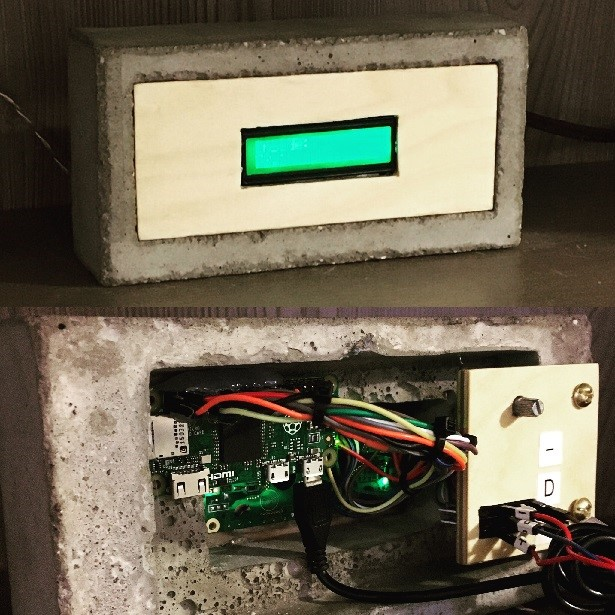

# Temperature Brick



The temperature brick is handmade of concrete and contains an LCD screen that displays the current temperature, as well as the high and low tmeperatures for the day.

# Parts Needed

- 1 x [Raspberry Pi Zero W](https://www.raspberrypi.org/products/raspberry-pi-zero-w/)
- 1 x [16 x 2 Standard LCD](https://www.adafruit.com/product/181)
- Hook up wires

# Construction

Wire your LCD screen to your Raspberry Pi Zero W using the following directions: 

https://learn.adafruit.com/drive-a-16x2-lcd-directly-with-a-raspberry-pi

# Software

Clone the following repositories onto your local machine

```bash
$ git clone https://github.com/CurtLH/temp_brick.git
$ git clone https://github.com/adafruit/Adafruit_Python_CharLCD.git
$ git clone https://github.com/adafruit/Adafruit_Python_DHT.git
```

Follow [these directions](https://github.com/adafruit/Adafruit_Python_CharLCD#adafruit_python_charlcd) to setup the LCD screen.

Follow [these directions](https://github.com/adafruit/Adafruit_Python_DHT#adafruit-python-dht-sensor-library) to setup the indoor temperature sensor. 

Install `psycopg2` Python package to be able to get recent temperatures from the PostgreSQL database.

```bash
$ pip install psycopg2-binary
```

Start displaying temperatures on the LCD screen

```bash
$ python monitor_wq.py
```
